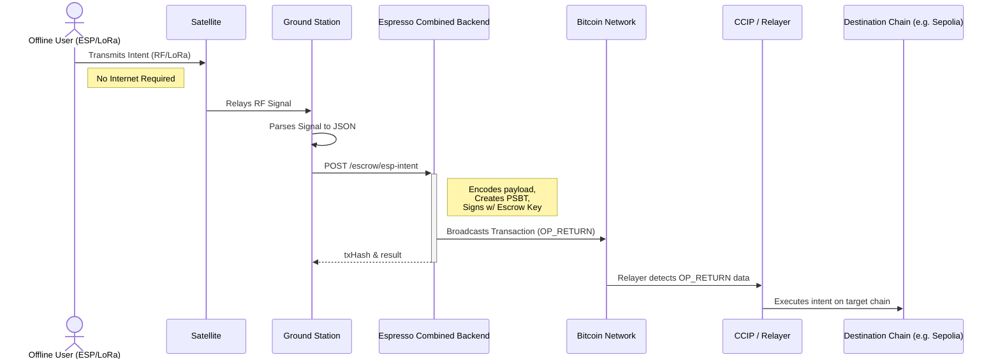

# Espresso Everywhere: Architecture

## High-Level Flow (No Internet Required for User)

Espresso enables true off-grid cross-chain intents relying completely on local RF + Satellite infrastructure without needing internet at the source point.

### The Lifecycle of an Espresso Intent

1. **User (Offline / No Internet):**
   - The user has an ESP32 or similar LoRa-enabled device.
   - The user crafts a cross-chain `intent` (e.g., to transfer tokens on an EVM chain like Sepolia or Polygon).
   - This intent is transmitted via **RF (LoRa)** to a satellite relay.

2. **Satellite to Ground Station:**
   - The **Satellite** captures the RF LoRa signal and relays it to a designated **Ground Station**.
   - The Ground Station, which is connected to the internet, receives the raw intent data.

3. **Ground Station Server:**
   - The Ground Station's server translates the raw satellite data into a structured HTTP POST request containing the `intent` details (destination chain, receiver, function signature, args).

4. **Espresso Combined Backend:**
   - The server makes a POST request to the **Espresso `combined-backend`** (specifically hitting the `/escrow/esp-intent` endpoint).
   - This backend processes the intent and automatically translates it into a Bitcoin transaction payload via the Bitcoin Multichain Protocol (Espresso) logic under the hood. 
   
5. **Escrow & Execution (In the Combined Backend):**
   - **`@espresso/esp-escrow`**: Validates the intent JSON.
   - Converts it into an OP_RETURN data payload intended for Bitcoin network execution.
   - Calls the internal `bitcoin-api` routes (`/psbt` and `/broadcast`) to embed this payload into a Bitcoin transaction.
   - Signs the transaction automatically using a funded **Escrow Key** (WIF).
   - Broadcasts the transaction to the Bitcoin network.

6. **Cross-Chain Delivery:**
   - Once broadcast, the OP_RETURN message is picked up by the relayer infrastructure.
   - Chainlink CCIP and the CRE layer route that intent to its eventual destination EVM chain, executing the user's operation.

### Component Diagram

